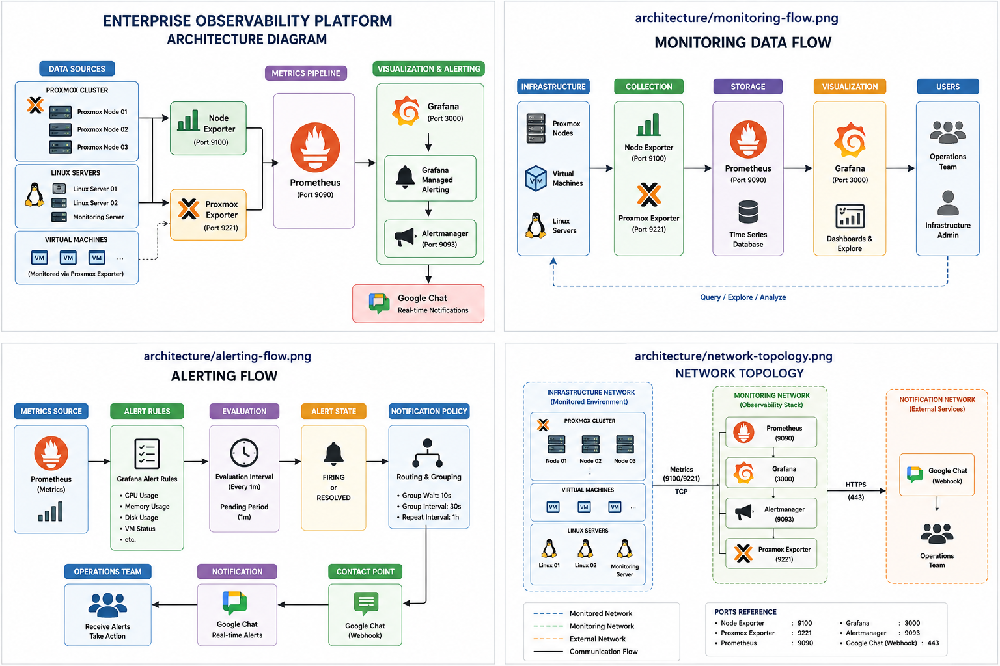
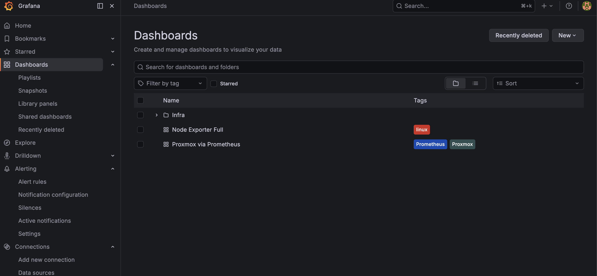
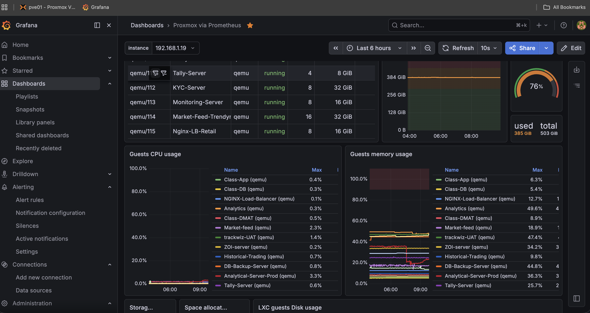
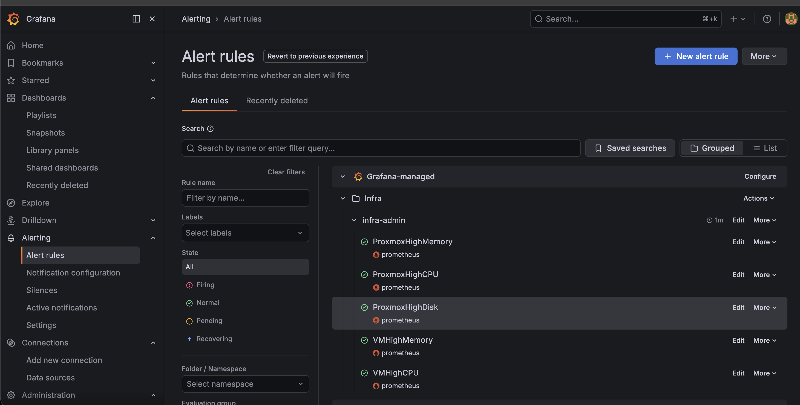
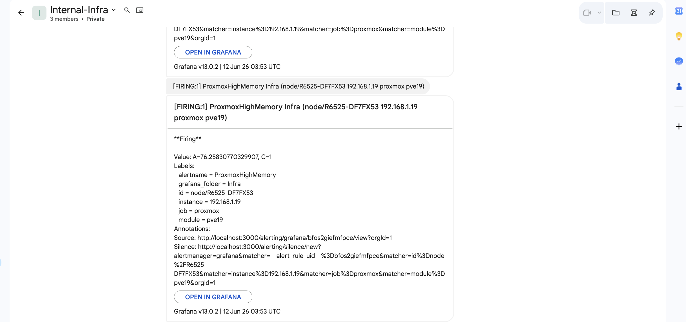

# Enterprise Observability Platform

## Overview

Enterprise-grade observability platform built using Prometheus, Grafana, Docker Compose, Proxmox Exporter, and Ansible.

This project provides centralized monitoring, visualization, and alerting for on-premises infrastructure including Proxmox hypervisors, virtual machines, and Linux servers.

The platform was designed to provide real-time visibility into infrastructure health, performance, resource utilization, and service availability while delivering proactive notifications through Google Chat.

---

## Architecture



### Monitoring Flow

Infrastructure → Exporters → Prometheus → Grafana → Google Chat Notifications

### Components

* Prometheus
* Grafana
* Proxmox Exporter
* Alertmanager
* Docker Compose
* Ansible
* Google Chat Integration
* Loki (Future Expansion)
* Tempo (Future Expansion)
* Blackbox Exporter (Future Expansion)
* SNMP Exporter (Future Expansion)

---

## Features

### Infrastructure Monitoring

* Proxmox Hypervisor Monitoring
* Virtual Machine Monitoring
* Linux Server Monitoring
* Resource Utilization Tracking
* Historical Performance Analysis

### Alerting

* Grafana Managed Alert Rules
* CPU Utilization Alerts
* Memory Utilization Alerts
* Disk Utilization Alerts
* Host Availability Monitoring
* Real-time Google Chat Notifications

### Automation

* Automated Node Exporter Deployment
* Dynamic Prometheus Target Generation
* Ansible-based Infrastructure Management

---

## Monitoring Stack

| Component        | Purpose                  |
| ---------------- | ------------------------ |
| Prometheus       | Metrics Collection       |
| Grafana          | Visualization & Alerting |
| Proxmox Exporter | Proxmox Metrics          |
| Alertmanager     | Alert Routing            |
| Docker Compose   | Container Orchestration  |
| Ansible          | Automation               |

---

## Implemented Alerts

### Proxmox Nodes

* ProxmoxHighMemory
* ProxmoxHighCPU
* ProxmoxHighDisk

### Virtual Machines

* VMHighMemory
* VMHighCPU

### Infrastructure

* LinuxHostDown
* ProxmoxNodeDown
* VMDown

---

## Repository Structure

```text
enterprise-observability-platform/
├── docker-compose/
├── prometheus/
├── grafana/
├── proxmox-exporter/
├── alertmanager/
├── ansible/
├── docs/
├── architecture/
└── images/
```

---

## Screenshots

### Infrastructure Dashboard



### Proxmox Dashboard



### Alert Rules



### Google Chat Notifications



---

## Skills Demonstrated

* Linux Administration
* Docker
* Docker Compose
* Prometheus
* Grafana
* PromQL
* Infrastructure Monitoring
* Observability
* Alerting
* Automation
* Ansible
* Proxmox VE
* DevOps Practices
* System Administration

---

## Future Enhancements

* Loki Log Aggregation
* Tempo Distributed Tracing
* SNMP Monitoring
* Blackbox Monitoring
* Service Dependency Mapping
* Multi-site Monitoring
* SLA Dashboards

